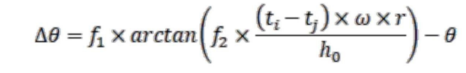
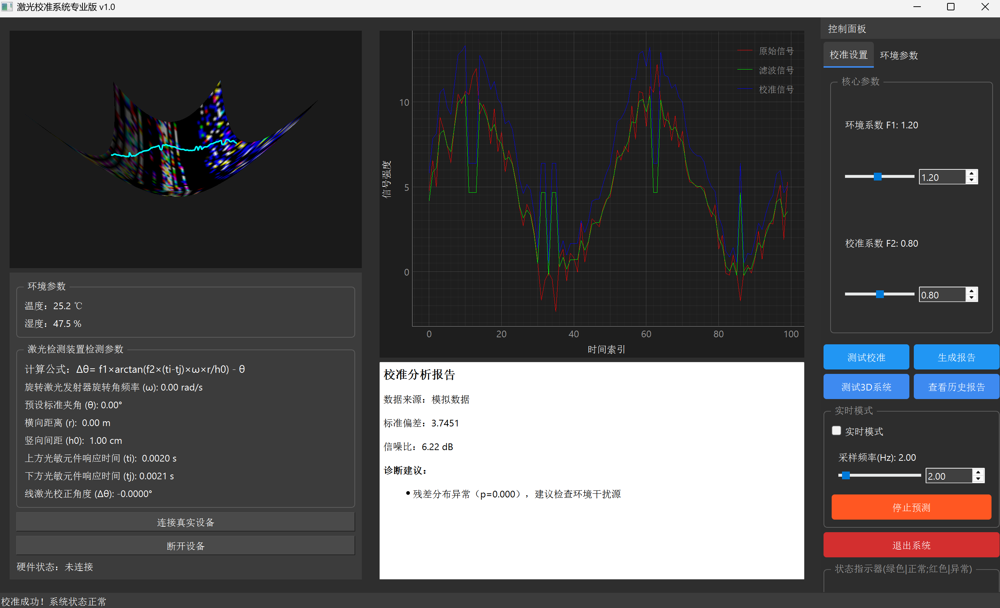

# 激光校准系统

## 项目简介

激光校准系统是一款专业用于激光信号校准和分析的软件，旨在帮助用户实现高精度的激光信号处理与校准。该系统具备强大的实时数据处理能力、多维度可视化功能以及智能诊断分析，适用于科研、工业生产等多种场景，能够显著提升激光设备的性能和稳定性。
- **项目的线激光校准公式基于时距转换算法，公式如下：**

- **软件界面概览：**

## 功能介绍

### 数据采集与处理

- **激光信号采集**：支持从虚拟和真实的激光传感器中采集原始激光信号。
- **自适应滤波**：采用先进的自适应滤波技术，动态去除噪声，提高信号质量。
- **动态校准**：根据环境参数（温度、湿度）实时调整校准系数，确保校准结果的准确性。

### 实时校准与分析

- **实时模式**：开启实时模式后，系统自动持续采集和校准激光信号，并实时更新2D和3D视图。
- **智能诊断**：对校准后的数据进行实时分析，提供关键指标（如标准偏差、信噪比等）和诊断建议。

### 多维度可视化

- **2D信号视图**：直观显示原始信号、滤波信号和校准信号的对比图表。
- **3D激光模拟**：基于OpenGL技术，提供三维激光束模拟视图，增强数据的空间理解。

### 报告与导出

- **专业报告生成**：一键生成包含多图表和详细分析数据的PDF报告。
- **历史报告管理**：支持查看、删除历史报告以及清空报告记录。

### 硬件连接与管理

- **设备连接**：支持连接真实激光设备和模拟设备，灵活适配不同应用场景。
- **参数调整**：允许用户自定义硬件参数（如旋转角频率、横向距离等），并实时反映在数据处理和校准过程中。

### 用户界面

- **直观控制面板**：集成功能按钮和参数调节滑块，方便用户操作。
- **状态监控**：实时显示系统状态、硬件连接状态和环境参数。

## 技术特点

- **高效数据处理**：采用多线程技术，确保数据采集、处理和UI更新的流畅性。
- **智能算法集成**：结合Isolation Forest等机器学习算法，实现异常检测和智能诊断。
- **灵活配置**：支持多种参数的自定义设置，满足不同用户需求。

## 使用方法

### 安装

1. 确保您已安装 Python 3.6 或更高版本
2. 进入项目目录：
    ```bash
   cd LaserCorre
3. 安装项目依赖：
   ```bash
   pip install pyqt5 pyqtgraph numpy scipy pandas sklearn pyqt5-tools reportlab matplotlib opengl
4. 启动软件：
   ```bash
   python LaserSyncV1.0.py
5. 基本操作
- **启动软件**：运行程序，进入主界面。
- **连接设备**：点击“连接真实设备”按钮，连接硬件（或使用模拟数据）。
- **测试系统**：点击“测试校准”按钮，测试系统校准功能是否正常；点击“测试3D系统”按钮，测试3D呈现是否正常
- **参数设置**：在控制面板中调整校准参数和环境参数。
- **开始校准**：点击“开始校准”按钮，系统自动执行校准流程。
- **实时模式**：勾选“实时模式”复选框，进入实时数据处理和校准。
- **查看报告**：点击“生成报告”按钮，生成PDF报告；在“查看历史报告”中管理报告。
- **退出系统**：点击“退出系统”按钮，安全关闭软件。